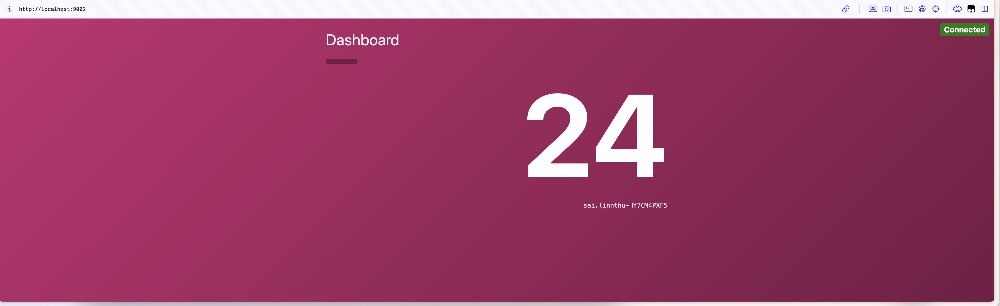

### Reference
```
https://github.com/hashicorp/demo-consul-101/releases
```

### counting-service
```
curl -LO https://github.com/hashicorp/demo-consul-101/releases/download/v0.0.5/counting-service_darwin_arm64.zip

unzip counting-service_darwin_arm64.zip

rm -rf counting-service_darwin_arm64.zip

mv counting-service_darwin_arm64 counting-service

chmod +x counting-service
```

### dashboard-service
```
curl -LO https://github.com/hashicorp/demo-consul-101/releases/download/v0.0.5/dashboard-service_darwin_arm64.zip

unzip dashboard-service_darwin_arm64.zip

rm -rf dashboard-service_darwin_arm64.zip

mv dashboard-service_darwin_arm64 dashboard-service

chmod +x dashboard-service
```


### Run `counting-service` on `port 9003` at Terminal 1
```
export PORT=9003
./counting-service

# another way to run as a single line
PORT=9003 ./counting-service
```
* You will see the following output:
```
Serving at http://localhost:9003
(Pass as PORT environment variable)
```

### Run `dashboard-service` on `port 9002` at Terminal 2
```
export PORT=9002
export COUNTING_SERVICE_URL="http://localhost:9003"
./dashboard-service

# another way to run as a single line
PORT=9002 COUNTING_SERVICE_URL="http://localhost:9003" ./dashboard-service
```
* You will see the following output:
```
Starting server on http://0.0.0.0:9002
(Pass as PORT environment variable)
Using counting service at http://localhost:9003
(Pass as COUNTING_SERVICE_URL environment variable)
Starting websocket server...
New client connected
Fetched count 5
Fetched count 6
New client connected
Fetched count 7
Fetched count 8
New client connected
Fetched count 9
Fetched count 10
New client connected
Fetched count 11
Fetched count 12
Fetched count 13
Fetched count 14
Fetched count 15
```

### Users > dashboard-service:9002 > counting-service:9003
* Access `http://localhost:9002` at your browser

### Dashboard Service UI
