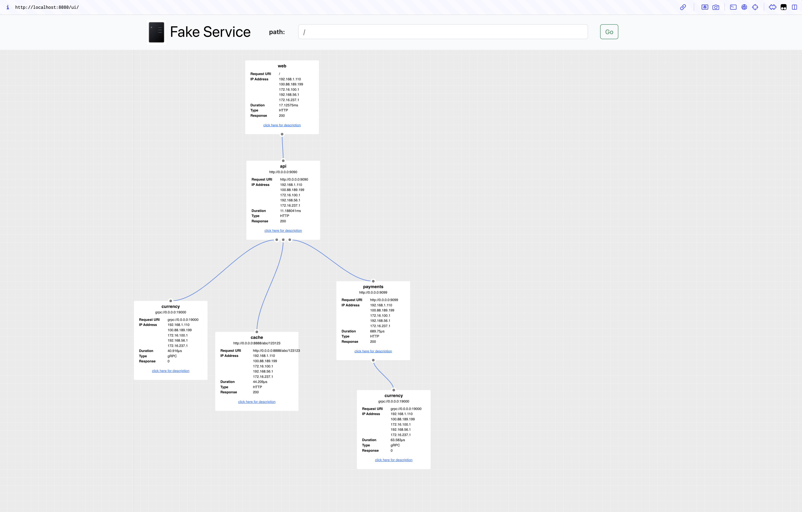

### Learning how to use fake-service
```
https://github.com/nicholasjackson/fake-service
```

* Download the binary (based on your OS) and unzip
```
cd 0-basic-usage

wget https://github.com/nicholasjackson/fake-service/releases/download/v0.26.2/fake_service_darwin_arm64.zip

unzip fake_service_darwin_arm64.zip

chmod +x fake-service
```

* Launch Terminal 1 - Run the `fake-service` on port `19090`
```
LISTEN_ADDR=0.0.0.0:19090 ./fake-service
```
* You will see the following output:
```
2025-08-02T23:17:50.640+0800 [INFO]  Using seed: seed=1754147870
2025-08-02T23:17:50.641+0800 [INFO]  Adding handler for UI static files
2025-08-02T23:17:50.641+0800 [INFO]  Settings CORS options: allow_creds=false allow_headers="Accept,Accept-Language,Content-Language,Origin,Content-Type" allow_origins="*"
2025-08-02T23:17:50.642+0800 [INFO]  Started service: name=Service upstreamURIs="" upstreamWorkers=1 listenAddress=0.0.0.0:19090
```
* Launch Terminal 2 - Try to connect to the service using the `curl`
* Fake service will respond with a json payload similar to the following:
```
$ curl localhost:19090
{
  "name": "Service",
  "uri": "/",
  "type": "HTTP",
  "ip_addresses": [
    "192.168.1.110",
    "100.88.189.199",
    "172.16.100.1",
    "192.168.56.1",
    "172.16.237.1"
  ],
  "start_time": "2025-08-02T23:18:46.720348",
  "end_time": "2025-08-02T23:18:46.723555",
  "duration": "3.206291ms",
  "body": "Hello World",
  "code": 200
}
```
* You could have also made this request using the browser based ui that is available at the following url: http://localhost:19090/ui

* Launch Terminal 3 - Run the `fake-service` on another port `18000` with environment variables `MESSAGE="Response Hello Cloud Frontend Microservice"` and `NAME=frontend`
```
LISTEN_ADDR=0.0.0.0:18000 MESSAGE="Response Hello Cloud Frontend Microservice Hello Cloud" NAME="frontend" ./fake-service
```
```
2025-08-02T23:31:50.950+0800 [INFO]  Using seed: seed=1754148710
2025-08-02T23:31:50.951+0800 [INFO]  Adding handler for UI static files
2025-08-02T23:31:50.951+0800 [INFO]  Settings CORS options: allow_creds=false allow_headers="Accept,Accept-Language,Content-Language,Origin,Content-Type" allow_origins="*"
2025-08-02T23:31:50.951+0800 [INFO]  Started service: name=frontend upstreamURIs="" upstreamWorkers=1 listenAddress=0.0.0.0:18000
```
* Launch Terminal 4 - Try to connect to the service using the `curl`
* Fake service will respond with a json payload similar to the following:
```
$ curl localhost:18000
{
  "name": "frontend",
  "uri": "/",
  "type": "HTTP",
  "ip_addresses": [
    "192.168.1.110",
    "100.88.189.199",
    "172.16.100.1",
    "192.168.56.1",
    "172.16.237.1"
  ],
  "start_time": "2025-08-02T23:32:24.801990",
  "end_time": "2025-08-02T23:32:24.802374",
  "duration": "384.084µs",
  "body": "Response Hello Cloud Frontend Microservice Hello Cloud",
  "code": 200
}
```
### Install `grpcurl` 
```
asdf plugin-list all | grep grpcurl
grpcurl                       https://github.com/asdf-community/asdf-grpcurl.git
```
```
asdf plugin-add grpcurl https://github.com/asdf-community/asdf-grpcurl.git

asdf list all grpcurl
asdf install grpcurl 1.9.3
asdf global grpcurl 1.9.3
```
```
$ grpcurl --version
grpcurl v1.9.3

```

* Launch Terminal 5- Run the `fake-service` on another port `9090` with environment variables `MESSAGE="Response from currency microservice"` and `NAME="curreny"`
```
LISTEN_ADDR=0.0.0.0:9090 MESSAGE="Response from currency microservice" NAME="currency" ./fake-service
```
```
2025-08-02T23:42:10.796+0800 [INFO]  Using seed: seed=1754149330
2025-08-02T23:42:10.797+0800 [INFO]  Adding handler for UI static files
2025-08-02T23:42:10.797+0800 [INFO]  Settings CORS options: allow_creds=false allow_headers="Accept,Accept-Language,Content-Language,Origin,Content-Type" allow_origins="*"
2025-08-02T23:42:10.797+0800 [INFO]  Started service: name=currency upstreamURIs="" upstreamWorkers=1 listenAddress=0.0.0.0:9090
```
* Note
    * The fake-service application is designed to handle both HTTP and gRPC protocols on the same port simultaneously. 
    * The core reason is that fake-service uses a library called [cmux](https://github.com/soheilhy/cmux).
        * https://github.com/nicholasjackson/fake-service/blob/main/main.go#L259
    * This Go library lets a server listen on a single TCP port and then split (“multiplex”) incoming connections by protocol:
        * HTTP/1.1 (typical REST, browser traffic, curl, etc.)
            * https://github.com/nicholasjackson/fake-service/blob/main/main.go#L260
        * HTTP/2/gRPC (gRPC uses HTTP/2 under the hood)
            * https://github.com/nicholasjackson/fake-service/blob/main/main.go#L261
        * ...even raw TCP if desired
    * The fake-service uses protocol detection to determine whether an incoming request is HTTP or gRPC:
        1. gRPC Detection: When a gRPC client connects, it sends specific headers like:
            * `content-type: application/grpc`
            * gRPC-specific metadata
            * Uses HTTP/2 with gRPC framing
        2. HTTP Detection: Regular HTTP requests have different characteristics:
            * Standard HTTP headers
            * Different content types (like `application/json`)
            * Can use HTTP/1.1 or HTTP/2
        3. Reference
            * https://github.com/nicholasjackson/fake-service/blob/main/main.go#L287
            * https://github.com/nicholasjackson/fake-service/blob/main/main.go#L298

```
$ grpcurl -plaintext localhost:9090 FakeService.Handle | jq -r .Message
{
  "name": "currency",
  "type": "gRPC",
  "ip_addresses": [
    "192.168.1.110",
    "100.88.189.199",
    "172.16.100.1",
    "192.168.56.1",
    "172.16.237.1"
  ],
  "start_time": "2025-08-02T23:53:13.254401",
  "end_time": "2025-08-02T23:53:13.254590",
  "duration": "188.75µs",
  "body": "Response from currency microservice",
  "code": 0
}
```
* Logs for grpc
```
2025-08-02T23:53:13.254+0800 [INFO]  Handling request gRPC request:
  context=
  | key: content-type value: [application/grpc]
  | key: user-agent value: [grpcurl/v1.9.3 grpc-go/1.61.0]
  | key: grpc-accept-encoding value: [gzip]
  | key: :authority value: [localhost:9090]
  
2025-08-02T23:53:13.254+0800 [INFO]  Finished handling request: duration="254.083µs"
```
```
$ curl localhost:9090
{
  "name": "currency",
  "uri": "/",
  "type": "HTTP",
  "ip_addresses": [
    "192.168.1.110",
    "100.88.189.199",
    "172.16.100.1",
    "192.168.56.1",
    "172.16.237.1"
  ],
  "start_time": "2025-08-02T23:53:26.150381",
  "end_time": "2025-08-02T23:53:26.150421",
  "duration": "39.916µs",
  "body": "Response from currency microservice",
  "code": 200
}
```
* Logs for http
```
2025-08-02T23:53:26.150+0800 [INFO]  Handle inbound request:
  request=
  | GET / HTTP/1.1
  | Host: localhost:9090
  | user-agent: curl/8.7.1
  | accept: */*
  
2025-08-02T23:53:26.150+0800 [INFO]  Finished handling request: duration="57.417µs"

```

#### `web:8080` -> `UPSTREAM_URIS="http://api:9090"`
```
LISTEN_ADDR=0.0.0.0:8080 MESSAGE="Response web microservice" NAME="web" UPSTREAM_URIS="http://api:9090" ./fake-service
```

#### `api:9090` -> `UPSTREAM_URIS="grpc://currency:19000, http://cache:8888/abc/123123, http://payments:9099"`
```
LISTEN_ADDR=0.0.0.0:9090 MESSAGE="Response api microservice" NAME="api" UPSTREAM_URIS="grpc://currency:19000, http://cache:8888/abc/123123, http://payments:9099" ./fake-service
```

#### `cache:8888`
```
LISTEN_ADDR=0.0.0.0:8888 MESSAGE="Response cache microservice" NAME="cache" ./fake-service
```

#### `payments:9099` -> `UPSTREAMS_URIS="grpc://currency:19000"`
```
LISTEN_ADDR=0.0.0.0:9099 MESSAGE="Response payments microservice" NAME="payments" UPSTREAM_URIS="grpc://currency:19000" ./fake-service
```

#### `currency:19000`
```
LISTEN_ADDR=0.0.0.0:19000 MESSAGE="Response currency microservice" NAME="currency" SERVER_TYPE=grpc ./fake-service
```

* Access web microservice annd web Fake service will respond with a json payload similar to the following:
```
$ curl localhost:8080
{
  "name": "web",
  "uri": "/",
  "type": "HTTP",
  "ip_addresses": [
    "192.168.1.110",
    "100.88.189.199",
    "172.16.100.1",
    "192.168.56.1",
    "172.16.237.1"
  ],
  "start_time": "2025-08-03T00:54:07.285931",
  "end_time": "2025-08-03T00:54:07.301743",
  "duration": "15.811208ms",
  "body": "Response web microservice",
  "upstream_calls": {
    "http://0.0.0.0:9090": {
      "name": "api",
      "uri": "http://0.0.0.0:9090",
      "type": "HTTP",
      "ip_addresses": [
        "192.168.1.110",
        "100.88.189.199",
        "172.16.100.1",
        "192.168.56.1",
        "172.16.237.1"
      ],
      "start_time": "2025-08-03T00:54:07.290149",
      "end_time": "2025-08-03T00:54:07.301323",
      "duration": "11.174875ms",
      "headers": {
        "Content-Type": "text/plain; charset=utf-8",
        "Date": "Sat, 02 Aug 2025 16:54:07 GMT"
      },
      "body": "Response api microservice",
      "upstream_calls": {
        "grpc://0.0.0.0:19000": {
          "name": "currency",
          "uri": "grpc://0.0.0.0:19000",
          "type": "gRPC",
          "ip_addresses": [
            "192.168.1.110",
            "100.88.189.199",
            "172.16.100.1",
            "192.168.56.1",
            "172.16.237.1"
          ],
          "start_time": "2025-08-03T00:54:07.291395",
          "end_time": "2025-08-03T00:54:07.291903",
          "duration": "507.958µs",
          "headers": {
            "content-type": "application/grpc"
          },
          "body": "Response currency microservice",
          "code": 0
        },
        "http://0.0.0.0:8888/abc/123123": {
          "name": "cache",
          "uri": "http://0.0.0.0:8888/abc/123123",
          "type": "HTTP",
          "ip_addresses": [
            "192.168.1.110",
            "100.88.189.199",
            "172.16.100.1",
            "192.168.56.1",
            "172.16.237.1"
          ],
          "start_time": "2025-08-03T00:54:07.295999",
          "end_time": "2025-08-03T00:54:07.296027",
          "duration": "27.667µs",
          "headers": {
            "Content-Length": "365",
            "Content-Type": "text/plain; charset=utf-8",
            "Date": "Sat, 02 Aug 2025 16:54:07 GMT"
          },
          "body": "Response cache microservice",
          "code": 200
        },
        "http://0.0.0.0:9099": {
          "name": "payments",
          "uri": "http://0.0.0.0:9099",
          "type": "HTTP",
          "ip_addresses": [
            "192.168.1.110",
            "100.88.189.199",
            "172.16.100.1",
            "192.168.56.1",
            "172.16.237.1"
          ],
          "start_time": "2025-08-03T00:54:07.299910",
          "end_time": "2025-08-03T00:54:07.300362",
          "duration": "451.541µs",
          "headers": {
            "Content-Length": "928",
            "Content-Type": "text/plain; charset=utf-8",
            "Date": "Sat, 02 Aug 2025 16:54:07 GMT"
          },
          "body": "Response payments microservice",
          "upstream_calls": {
            "grpc://0.0.0.0:19000": {
              "name": "currency",
              "uri": "grpc://0.0.0.0:19000",
              "type": "gRPC",
              "ip_addresses": [
                "192.168.1.110",
                "100.88.189.199",
                "172.16.100.1",
                "192.168.56.1",
                "172.16.237.1"
              ],
              "start_time": "2025-08-03T00:54:07.300150",
              "end_time": "2025-08-03T00:54:07.300172",
              "duration": "22.042µs",
              "headers": {
                "content-type": "application/grpc"
              },
              "body": "Response currency microservice",
              "code": 0
            }
          },
          "code": 200
        }
      },
      "code": 200
    }
  },
  "code": 200
}
```
* You could have also made this request using the browser based ui that is available at the following url: http://localhost:8080/ui

### Fake Service Example UI

